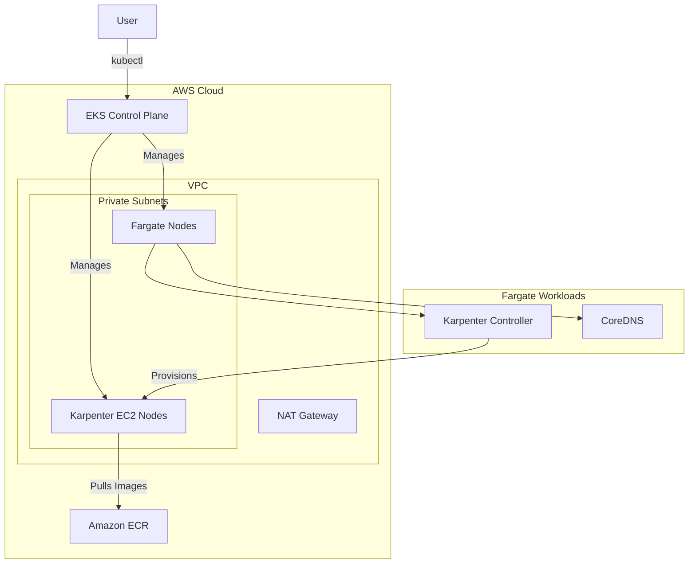
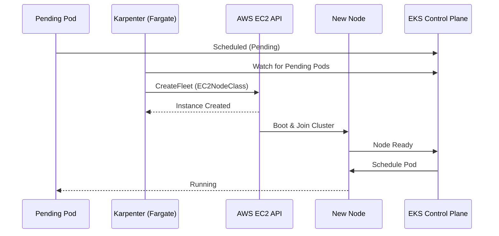

# Seafarer Cloud Infrastructure - EKS Fargate & Karpenter

This repository contains the Terraform configuration for the Seafarer Cloud EKS cluster. The infrastructure is designed to be serverless-first, utilizing **AWS Fargate** for the control plane and system components, and **Karpenter** for dynamic, just-in-time provisioning of EC2 worker nodes.

## Architecture Overview

The cluster uses a hybrid compute approach:

1. **Fargate Profiles**:
   - `kube-system`: Core Kubernetes components (CoreDNS, VPC CNI, etc.) run on Fargate.
   - `karpenter`: The Karpenter controller runs on Fargate to ensure it is independent of the nodes it manages.
2. **Karpenter**:
   - Provisions EC2 nodes (Spot or On-Demand) based on pending pod requirements.
   - Manages the lifecycle of nodes (provisioning, disruption, consolidation).

### Diagrams

#### Component Flow



#### Node Provisioning Sequence



## Modules Used

- **EKS**: `terraform-aws-modules/eks/aws` (v21.0+)
- **VPC**: `terraform-aws-modules/vpc/aws`
- **Karpenter**: `terraform-aws-modules/eks/aws//modules/karpenter`

## Prerequisites

- Terraform >= 1.0
- AWS CLI
- kubectl
- helm

## Deployment

1. **Initialize Terraform**:

   ```bash
   terraform init
   ```

2. **Plan Changes**:

   ```bash
   terraform plan
   ```

3. **Apply Changes**:

   ```bash
   terraform apply
   ```

4. **Configure kubectl**:

   ```bash
   aws eks update-kubeconfig --name Seafarer-cluster --region eu-west-3
   ```

## Karpenter Configuration

Karpenter is configured with a default `NodePool` and `EC2NodeClass`.

- **NodePool**: `default`

  - Instance Families: Flexible (all Nitro-based families)
  - CPU: Flexible (any size that fits the pod)
  - Hypervisor: Nitro
  - Capacity Type: Spot & On-Demand (default behavior)
  - Consolidation: Enabled (WhenEmpty)

- **EC2NodeClass**: `default`
  - AMI Family: AL2023 (Amazon Linux 2023)
  - Discovery Tags: `karpenter.sh/discovery: Seafarer-cluster`
