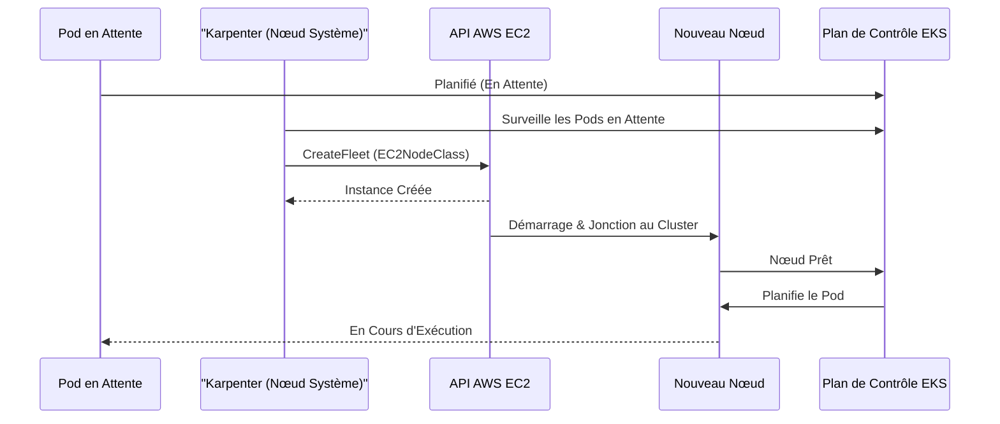

# Infrastructure Cloud Seafarer - EKS Fargate & Karpenter (Explication Simple)

Ce dépôt contient la configuration Terraform pour le cluster EKS (Elastic Kubernetes Service) de Seafarer Cloud. En termes simples, c'est comme un plan de construction pour notre "centre de données virtuel" sur AWS. L'infrastructure est conçue pour être "serverless-first", ce qui signifie que nous essayons de ne pas nous soucier directement des serveurs. Pour cela, elle utilise **AWS Fargate** pour les parties principales de Kubernetes (le "cerveau" du cluster) et **Karpenter** pour ajouter automatiquement des serveurs (appelés "nœuds de travail EC2") au fur et à mesure que nos applications en ont besoin, et ce, juste à temps.

## Aperçu de l'Architecture (Comment ça Marche ?)

Notre cluster utilise une approche entièrement basée sur des instances EC2, optimisée pour la flexibilité et la gestion des coûts :

1.  **Groupe de Nœuds Managé (System)** :

    - Un groupe de nœuds géré par EKS (`system-node-group`) héberge les composants critiques du système, tels que CoreDNS, VPC CNI, le pilote EBS CSI et **Karpenter** lui-même.
    - Ce groupe est configuré avec une haute disponibilité (minimum 2 nœuds) pour assurer que les services essentiels restent toujours actifs.

2.  **Karpenter (Le Gestionnaire de Serveurs Intelligent)** :
    - Karpenter surveille les applications (Pods) en attente et provisionne dynamiquement des nœuds EC2 supplémentaires pour les héberger.
    - Il choisit intelligemment le type d'instance le plus adapté (CPU, RAM) et le moins cher (Spot ou On-Demand) pour vos charges de travail.
    - Il gère tout le cycle de vie de ces serveurs : création, suppression (quand ils sont vides) et consolidation.

### Diagrammes (Les Schémas Explicatifs)

Ces diagrammes vous aident à visualiser comment les différents composants interagissent.

#### Flux des Composants

```mermaid
graph TD
    subgraph AWS Cloud
        subgraph VPC
            subgraph Private Subnets
                SystemNodes[Nœuds Système (MNG)]
                WorkloadNodes["Nœuds de Charge (Karpenter)"]
            end

            NAT[Passerelle NAT]
        end

        EKS[Plan de Contrôle EKS]
        ECR[Amazon ECR]
    end

    User -->|kubectl| EKS
    EKS -->|Gère| SystemNodes
    EKS -->|Gère| WorkloadNodes

    subgraph System Workloads
        KarpenterCtrl[Contrôleur Karpenter]
        CoreDNS
        EBSCSI[Pilote EBS CSI]
    end

    SystemNodes --> KarpenterCtrl
    SystemNodes --> CoreDNS
    SystemNodes --> EBSCSI

    KarpenterCtrl -->|Provisionne| WorkloadNodes
    WorkloadNodes -->|Tire les Images| ECR
```

- **Explication du diagramme :** EKS gère un groupe de nœuds système (Managed Node Group) où tournent les services critiques comme Karpenter. Karpenter, depuis ces nœuds système, observe le cluster et demande à AWS de créer de nouveaux "Nœuds de Charge" pour vos applications.

#### Séquence de Provisionnement des Nœuds (Comment un Nouveau Serveur est Ajouté)



- **Explication du diagramme :** Lorsqu'une application (un "Pod") a besoin de démarrer mais qu'il n'y a pas de place, elle est mise "en attente". Karpenter (qui tourne sur un nœud système) détecte cela et provisionne un nouveau nœud EC2. Une fois le nœud prêt, EKS y place le Pod.

## Modules Utilisés (Les Blocs de Construction Terraform)

Nous utilisons des modules Terraform pré-existants pour simplifier la configuration de notre infrastructure :

- **EKS**: `terraform-aws-modules/eks/aws` (v21.0+) - Ce module nous aide à configurer facilement le cluster EKS lui-même, qui est le cœur de notre système Kubernetes sur AWS.
- **VPC**: `terraform-aws-modules/vpc/aws` - Ce module configure notre "réseau virtuel" privé (VPC) sur AWS, en créant les sous-réseaux, les tables de routage, etc., pour que nos serveurs puissent communiquer de manière sécurisée.
- **Karpenter**: `terraform-aws-modules/eks/aws//modules/karpenter` - Ce module spécifique à Karpenter nous permet d'intégrer et de configurer facilement Karpenter dans notre cluster EKS existant.

## Prérequis (Ce Dont Vous Avez Besoin Avant de Commencer)

Avant de pouvoir déployer cette infrastructure, assurez-vous d'avoir installé les outils suivants sur votre machine :

- **Terraform >= 1.0**: C'est l'outil qui nous permet de décrire et de déployer notre infrastructure sous forme de code.
- **AWS CLI**: L'interface en ligne de commande d'AWS, nécessaire pour interagir avec les services Amazon depuis votre terminal.
- **kubectl**: L'outil en ligne de commande standard pour interagir avec les clusters Kubernetes.
- **helm**: Un gestionnaire de paquets pour Kubernetes, utilisé pour déployer des applications pré-configurées.

## Déploiement (Comment Lancer l'Infrastructure)

Suivez ces étapes pour déployer l'infrastructure sur AWS :

1.  **Initialiser Terraform**:

    ```bash
    terraform init
    ```

    Cette commande prépare votre répertoire Terraform en téléchargeant les plugins et modules nécessaires. C'est la première chose à faire quand vous commencez ou mettez à jour votre configuration Terraform.

2.  **Planifier les Changements**:

    ```bash
    terraform plan
    ```

    Cette commande vous montre exactement ce que Terraform va faire (quels services AWS seront créés, modifiés ou supprimés) _avant_ de les appliquer. C'est une étape cruciale pour vérifier que tout est conforme à vos attentes.

3.  **Appliquer les Changements**:

    ```bash
    terraform apply
    ```

    C'est la commande qui va réellement créer ou modifier les ressources sur AWS, en se basant sur le plan que vous avez validé. Tapez `yes` lorsque Terraform vous le demande pour confirmer.

4.  **Configurer kubectl**:
    ```bash
    aws eks update-kubeconfig --name Seafarer-cluster --region eu-west-3
    ```
    Après le déploiement du cluster EKS, cette commande met à jour votre fichier de configuration `kubectl` (généralement situé dans `~/.kube/config`). Cela permet à `kubectl` de savoir comment se connecter à votre nouveau cluster EKS et de commencer à interagir avec lui. Remplacez `eu-west-3` par la région AWS où vous avez déployé le cluster si elle est différente.

## Configuration de Karpenter (Comment Karpenter Prend Ses Décisions)

Karpenter est configuré avec un `NodePool` (un groupe de nœuds) et un `EC2NodeClass` (une classe de nœuds EC2) par défaut. Ces configurations dictent quel type de serveurs Karpenter peut créer et comment il doit les gérer.

- **NodePool**: `default` (Le "Panier" de Nœuds par Défaut)

  - Instance Families (Familles d'instances) : `Flexible` (toutes les familles basées sur Nitro) - Cela signifie que Karpenter peut choisir parmi une large gamme de types de serveurs basés sur la plateforme Nitro d'AWS, ce qui offre une grande flexibilité et souvent de meilleures performances.
  - CPU : `Flexible` (toute taille qui correspond au pod) - Karpenter est intelligent et peut choisir un serveur avec la bonne quantité de CPU pour faire tourner l'application en attente, évitant ainsi le gaspillage de ressources.
  - Hypervisor (Hyperviseur) : `Nitro` - Spécifie que les serveurs doivent utiliser l'hyperviseur Nitro d'AWS, connu pour sa sécurité et ses performances.
  - Capacity Type (Type de Capacité) : `Spot` & `On-Demand` (comportement par défaut) - Karpenter essaiera d'abord d'utiliser des instances Spot (moins chères mais qui peuvent être interrompues par AWS) et basculera vers des instances On-Demand (plus chères mais garanties) si les instances Spot ne sont pas disponibles ou ne sont pas adaptées.
  - Consolidation : `Enabled (WhenEmpty)` - Cette fonctionnalité permet à Karpenter de "nettoyer" le cluster. Si un serveur devient vide (plus aucune application ne tourne dessus), Karpenter le supprimera pour économiser des coûts, ou tentera de regrouper les applications restantes sur moins de serveurs pour optimiser l'utilisation.

- **EC2NodeClass**: `default` (La "Recette" pour les Nœuds EC2)
  - AMI Family (Famille d'AMI) : `AL2023` (Amazon Linux 2023) - Spécifie le système d'exploitation de base qui sera installé sur les nouveaux serveurs. Ici, c'est la dernière version d'Amazon Linux, optimisée pour AWS.
  - Discovery Tags (Tags de Découverte) : `karpenter.sh/discovery: Seafarer-cluster` - C'est une étiquette spéciale que Karpenter ajoute aux serveurs qu'il provisionne. Elle permet aux différents composants (Karpenter, EKS) de facilement identifier et gérer les serveurs qui appartiennent à ce cluster `Seafarer-cluster`.
